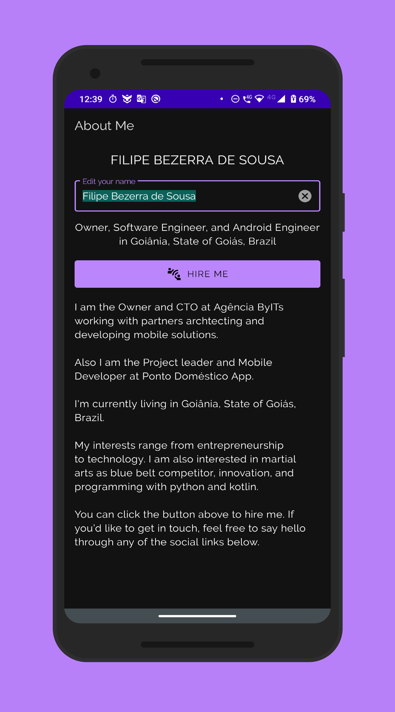

# About Me App

## Project Overview

About Me app is editable "About Me" page for Android. It's created while I've been continuously learning Android Kotlin Development at Udacity Nanodegree.

## Showcase

    
    

## Live Running

